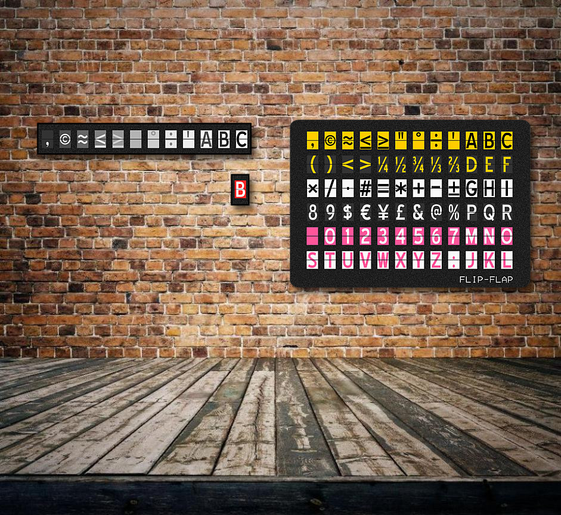

# Alphabets

Welcome to the public repository of the second edition of the worldwide loved **open source split-flap display**. Please find information about the first release [here](V1).

Please also check the [YouTube videos](https://www.youtube.com/playlist?list=PLKDpiLmgp6EuLGCovD-QFxrmyNdrbUmKX)

## What's new
* 120% pure awesomeness.
* Build your own for free or order a kit or ready built module.
* Entirely designed with widely adopted open source software.
* No more gears, direct drive motor
* Assemble in multiple layouts of rows and columns.
* Networked electronics: Connect from one to infinite modules together.
* Custom colors: Request custom colored modules and custom characters.
* Web based interface: Control your modules interactively with your web browser.
* Twitter interface: Create a twitter account for your installation and let the crowd interactively tweet to your modules.
