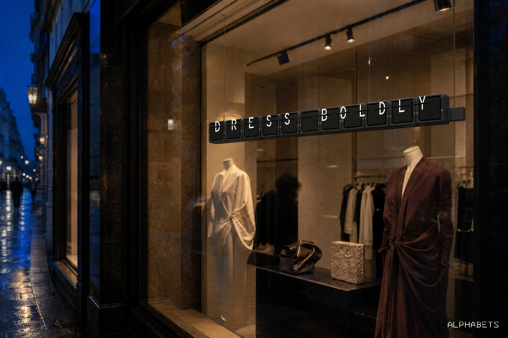
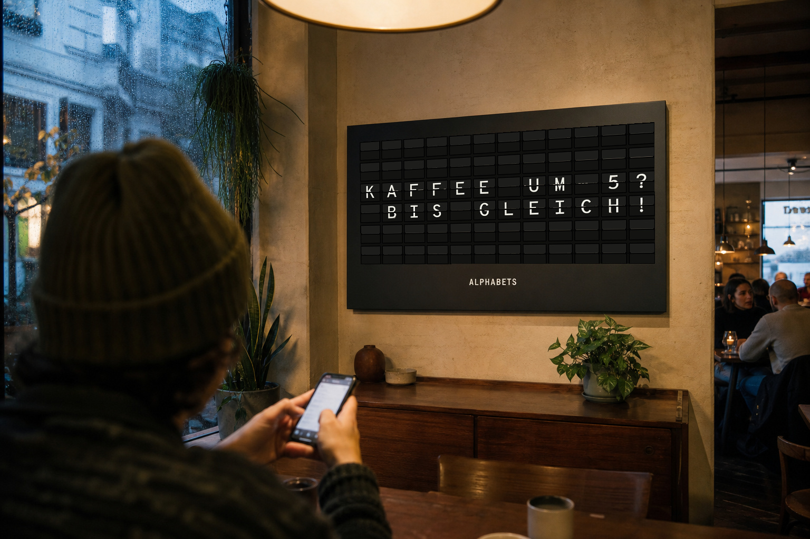

# Alphabets

Welcome to the public repository of the second edition of the worldwide loved **open source split-flap display**. Please find information about the first release [here](V1).

Please also check the [YouTube videos](https://www.youtube.com/playlist?list=PLKDpiLmgp6EuLGCovD-QFxrmyNdrbUmKX)

The V2 application-to-controller message protocol is documented in
[V2/MESSAGE_PROTOCOL.md](V2/MESSAGE_PROTOCOL.md). The controller-to-module
protocol is documented in [V2/PROTOCOL.md](V2/PROTOCOL.md).
The production module firmware is in
[V2/Firmware/attiny1624-module](V2/Firmware/attiny1624-module). The ATtiny44A
prototype firmware remains in
[V2/Firmware/attiny44-module](V2/Firmware/attiny44-module).
The selectable 64-position character presets and custom drum settings are
documented in [V2/Code/letters.md](V2/Code/letters.md).
The two incompatible physical V2 builds — the installed 55 mm prototype and
the 50 mm definitive hardware — are explicitly separated in
[V2/variants](V2/variants/README.md).
The parametric mechanical source and fabrication exports are in
[V2/Hardware/mechanical](V2/Hardware/mechanical/README.md).

## What's new
* 120% pure awesomeness.
* Build your own for free or order a kit or ready built module.
* Entirely designed with widely adopted open source software.
* No more gears, direct drive motor
* Assemble in multiple layouts of rows and columns.
* Networked electronics: Connect from one to infinite modules together.
* Custom colors: Request custom colored modules and custom characters.
* Web based interface: Control your modules interactively with your web browser.
* Twitter interface: Create a twitter account for your installation and let the crowd interactively tweet to your modules.

## License

Except where a file or directory states otherwise, Alphabets' original source
code, firmware, electronics designs, mechanical designs, documentation, and
generated project artifacts are licensed under the [MIT License](LICENSE).
Copyright (c) 2014 [The Beach Lab](https://beachlab.org).

First-party source files carry an SPDX license identifier where appropriate.
Binary and structured design formats inherit this repository-level declaration;
legacy and bundled third-party sources retain their existing notices and
licenses.
