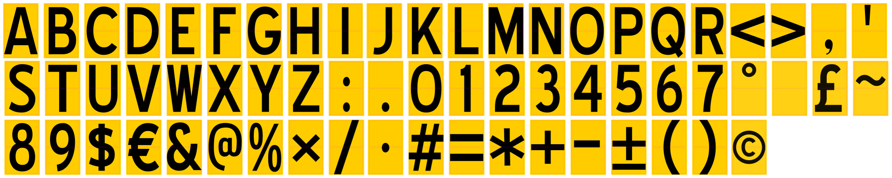

<!-- SPDX-FileCopyrightText: 2014-2026 The Beach Lab <https://beachlab.org> -->
<!-- SPDX-License-Identifier: MIT -->
# V2 Prototype stickers

[← Prototype mechanical CAD](../mechanical/README.md) · [Physical variants](../../variants/README.md) · [Shared generator →](../../Final/stickers/README.md)

V2 Prototype uses the **Demo 64** character order and two nominal `50 × 40 mm`
sticker cuts. The cuts are separated by a `1.8 mm` printed gap,
so each uninterrupted cut-aligned artwork cell is `50 × 81.8 mm`. Its colored
background extends `2 mm` past the outer cut lines, producing `54 × 85.8 mm`
background bounds without changing either finished sticker. Each face is
centred on a 55 × 43 mm card, leaving 2.5 mm at each side and an unstickered
3 mm strip at the free edge.



## Exact character order

```text
ABCDEFGHIJKLMNOPQRSTUVWXYZ:.0123456789$€&@%×/·#=*+-±()<>,'°■£~©␠
```

There are exactly 64 unique positions. `␠` above denotes the final ASCII space.
This order must match the physical cards and controller mapping.

## Current fabrication file

Use [`cut-print/cutprint.svg`](cut-print/cutprint.svg) to print and cut the
Prototype stickers. It is the fabrication artwork used for the ten sticker sets
printed in Dubai and contains both the colored vector artwork and cutter lines.

## Typeface

The fabrication artwork contains vector outlines, so printing does not depend
on fonts installed on the printer's computer. Its `W` and `%` use the condensed
Blue Highway outlines visible in the file.

[← Prototype mechanical CAD](../mechanical/README.md) · [Physical variants](../../variants/README.md) · [Shared generator →](../../Final/stickers/README.md)
