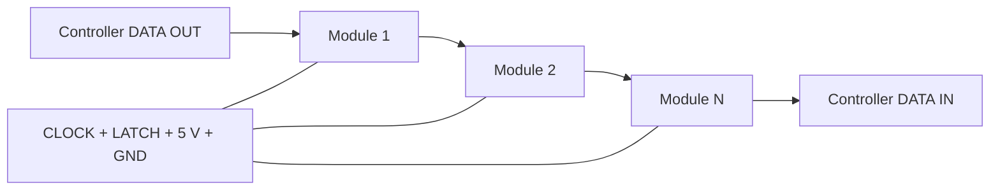

<!-- SPDX-FileCopyrightText: 2014-2026 The Beach Lab <https://beachlab.org> -->
<!-- SPDX-License-Identifier: MIT -->
# Chaining and cables

[← Motherboard](motherboard.md) · [Documentation index](README.md) · [Next: Protocol →](protocol.md)

The module boards form a synchronous serial ring. Four signals are shared by
every board, while the data signal passes through each module and returns to
the controller.

## Six chain signals

| Signal | Connection |
| --- | --- |
| `LATCH` | Shared frame boundary for every module |
| `CLOCK` | Shared serial clock for every module |
| `DATA_IN` | Data arriving from the previous board |
| `VCC` | Regulated 5 V module supply |
| `DATA_OUT` | Data regenerated for the next board |
| `GND` | Common electrical reference |

On the 2×3 connector, pins 1, 2, 4, and 6 are bused. Pin 5 (`DATA_OUT`) from
module *n* goes to pin 3 (`DATA_IN`) on module *n + 1*. The final module's
`DATA_OUT` returns to the controller.

## Why it is a ring

The return path carries module status and lets the controller discover the
chain length without assigning an address to every board. Physical chain order
is module order; software's `cell_to_module` map can then translate that order
into straight, serpentine, or custom display layouts.

> [!CAUTION]
> The logical connector definition is complete, but a production cable design,
> current budget, connector choice, and maximum validated cable length are not
> established in this repository. Validate power drop and signal quality on
> the intended display size.

See the exact timing and frame rules in the
[module protocol](../V2/Protocol/PROTOCOL.md).

[← Motherboard](motherboard.md) · [Documentation index](README.md) · [Next: Protocol →](protocol.md)
