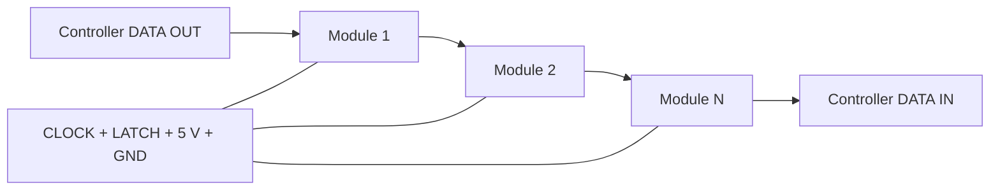

<!-- SPDX-FileCopyrightText: 2014-2026 The Beach Lab <https://beachlab.org> -->
<!-- SPDX-License-Identifier: MIT -->
# Chaining and cables

[← Motherboard](motherboard.md) · [Documentation index](README.md) · [Next: Protocol →](protocol.md)

The module boards form a synchronous serial ring. Four signals are shared by
every board, while the data signal passes through each module and returns to
the controller.

## Six chain signals

| Signal | Connection |
| --- | --- |
| `LATCH` | Shared frame boundary for every module |
| `CLOCK` | Shared serial clock for every module |
| `DATA_IN` | Data arriving from the previous board |
| `VCC` | Regulated 5 V module supply |
| `DATA_OUT` | Data regenerated for the next board |
| `GND` | Common electrical reference |

On the 2×3 connector, pins 1, 2, 4, and 6 are bused. Pin 5 (`DATA_OUT`) from
module *n* goes to pin 3 (`DATA_IN`) on module *n + 1*. The final module's
`DATA_OUT` returns to the controller.

## Power wiring for ten modules

The ten-module prototype uses a regulated 5 V supply sized for at least 3 A;
5 V at 4 A is recommended. Its shared `+5V` and `GND` conductors must carry the
2.0 A nominal simultaneous-motor peak documented in [Motors](motors.md), plus
the module electronics. There is no 12 V rail or buck converter in this power
path.

Use these copper conductor sizes:

| Path | Conductor size |
| --- | --- |
| Shared `+5V` and `GND` power pair | 0.75 mm² minimum recommended; use AWG 18 when buying AWG cable |
| Short power run carrying the full load, no more than 1 m one way | 0.5 mm² / AWG 20 minimum |
| `CLOCK`, `LATCH`, `DATA_IN`, and `DATA_OUT` | 0.14–0.25 mm² / AWG 26–24 |

At 5 V, voltage drop is the limiting factor before cable heating. Keep `+5V`
and `GND` together as a power pair, make the full-current feed short, and inject
power in parallel when a long row or connector chain would otherwise carry the
complete load through every small contact. Each connector and PCB power path
that carries the combined load must be rated for that current; cable gauge
alone does not make an underrated contact safe.

Before fixing the cable design, run all ten motors simultaneously and measure
the voltage between `+5V` and `GND` at the most distant motor driver. Also check
the supply lead, connectors, and PCB power paths for abnormal heating.

## Why it is a ring

The return path carries module status and lets the controller discover the
chain length without assigning an address to every board. Physical chain order
is module order; software's `cell_to_module` map can then translate that order
into straight, serpentine, or custom display layouts.

> [!CAUTION]
> The logical connector definition and ten-module cable allowance are
> documented, but the connector choice and maximum cable length still require
> physical validation. Validate power drop and signal quality on the intended
> display size.

See the exact timing and frame rules in the
[module protocol](../V2/Protocol/PROTOCOL.md).

[← Motherboard](motherboard.md) · [Documentation index](README.md) · [Next: Protocol →](protocol.md)
