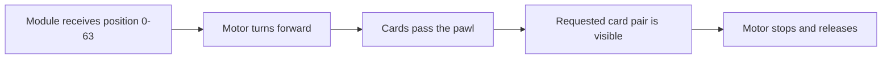

<!-- SPDX-FileCopyrightText: 2014-2026 The Beach Lab <https://beachlab.org> -->
<!-- SPDX-License-Identifier: MIT -->
# Drum

[← Stickers](stickers.md) · [Documentation index](README.md) · [Next: Enclosure →](enclosure.md)

The drum is the rotating frame inside one character module. It holds all 64
cards in a fixed order. The motor turns the drum forward while the pawl lets
the cards fall one at a time.

## Main dimensions

| Property | V2 Final value |
| --- | ---: |
| Card positions | 64 |
| Drum diameter | 85 mm |
| Space between the inner faces | 51 mm |
| Complete outside width | 55.3 mm |
| Card-pivot circle radius | 40 mm |

The 51 mm inside space is the 50 mm card body plus 1 mm total side clearance.
Two 2.15 mm drum sides make the complete drum 55.3 mm wide.

## How one position is selected

The controller never sends a character to a module. It sends a number from 0
to 63. The installed card order decides which character that number shows.

## Design files

- Editable drum geometry is in the
  [CadQuery mechanical model](../V2/Hardware/Final/mechanical/README.md).
- STEP, STL, DXF, SVG, and a machine-readable manifest are in
  [`V2/Hardware/Final/mechanical/generated`](../V2/Hardware/Final/mechanical/generated/).
- The full dimensional match is in the
  [physical variants contract](../V2/Hardware/variants/README.md).

> [!CAUTION]
> Generated geometry is not proof of a working mechanism. Check card fall,
> motor direction, shaft fit, pawl position, and clearances on one module.

[← Stickers](stickers.md) · [Documentation index](README.md) · [Next: Enclosure →](enclosure.md)
