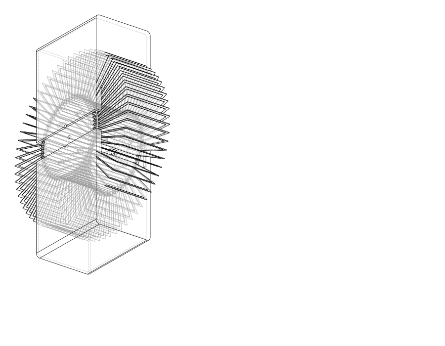

<!-- SPDX-FileCopyrightText: 2014-2026 The Beach Lab <https://beachlab.org> -->
<!-- SPDX-License-Identifier: MIT -->
# Enclosure

[← Drum](drum.md) · [Documentation index](README.md) · [Next: Motors →](motors.md)

The enclosure is the body around one drum. It keeps neighbouring modules
aligned, supports the motor and shaft, carries the electronics, and leaves the
front open so the character can be seen.

## Current V2 Final design

The enclosure is a two-part CadQuery model with an open front and rear. The
opening makes it possible to load cards, route wires, and service the mechanism.
The current model also includes:

- motor-side and shaft-side supports;
- space for the module electronics;
- alignment features for arranging modules in rows and columns;
- a separate front pawl;
- upper and lower printed parts.

The geometry is built around the captured card movement, not only around the
85 mm drum circle. That extra moving envelope matters because cards extend
beyond the drum while they flip.

## Files

- The editable source, parameters, commands, and validation notes are in the
  [mechanical README](../V2/Hardware/Final/mechanical/README.md).
- Printable STL and neutral STEP files are under
  [`generated/print`](../V2/Hardware/Final/mechanical/generated/print/) and
  [`generated/step`](../V2/Hardware/Final/mechanical/generated/step/).
- The alternative captured enclosure exports are under
  [`generated/captured-enclosure`](../V2/Hardware/Final/mechanical/generated/captured-enclosure/).

> [!WARNING]
> The enclosure is still a printable prototype. Test one complete module with
> the real drum, cards, motor, shaft, pawl, magnets, and cables before printing
> an array.

[← Drum](drum.md) · [Documentation index](README.md) · [Next: Motors →](motors.md)
