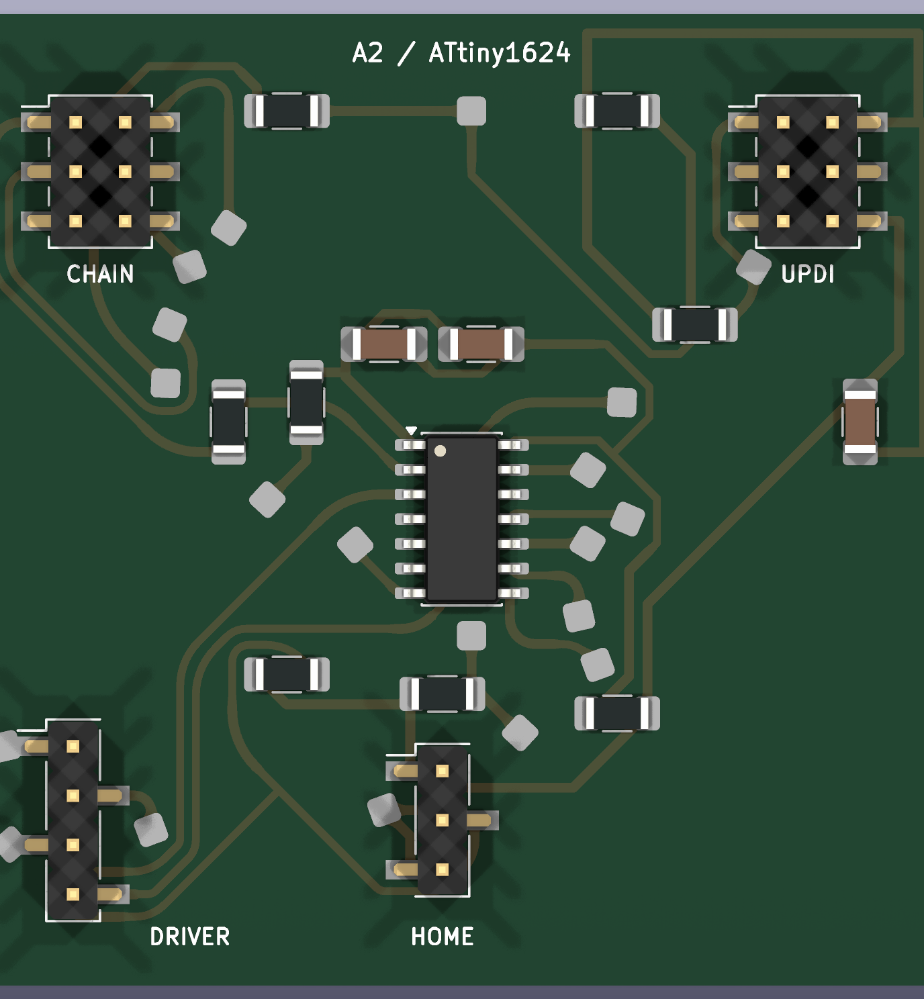
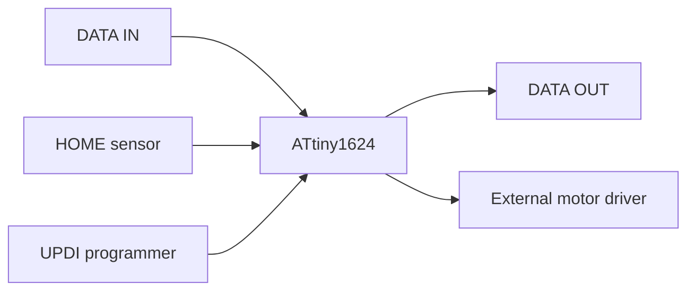

<!-- SPDX-FileCopyrightText: 2014-2026 The Beach Lab <https://beachlab.org> -->
<!-- SPDX-License-Identifier: MIT -->
# Module board

[← Motors](motors.md) · [Documentation index](README.md) · [Next: Motherboard →](motherboard.md)

Each character has an identical module board. The board receives one command
from the chain, controls one motor, reads one HOME sensor, and sends its status
back through the ring.

## Main parts

| Part | Purpose |
| --- | --- |
| ATtiny1624 | Runs the module firmware |
| Chain connector | LATCH, CLOCK, DATA IN, DATA OUT, 5 V, and ground |
| Motor-driver connector | Four phase-control signals |
| HOME connector | 5 V, sensor signal, and ground |
| UPDI connector | Programs and debugs the microcontroller |

The current board is 50 × 50 mm and routes all PCB copper on one side. It uses
insulated wire links where signals must cross. That construction choice is
intended to make the board practical to mill and hand assemble.

## Signal path

## Design and fabrication files

The [board README](../V2/Hardware/Final/electronics/attiny1624-ring/README.md)
explains the circuit, connector pinouts, single-sided routing, and validation
commands. The same directory contains editable KiCad files, fabrication
exports, previews, and saved ERC/DRC reports.

> [!CAUTION]
> Passing electrical-rule and design-rule checks does not replace assembly and
> electrical testing on a real board.

[← Motors](motors.md) · [Documentation index](README.md) · [Next: Motherboard →](motherboard.md)
