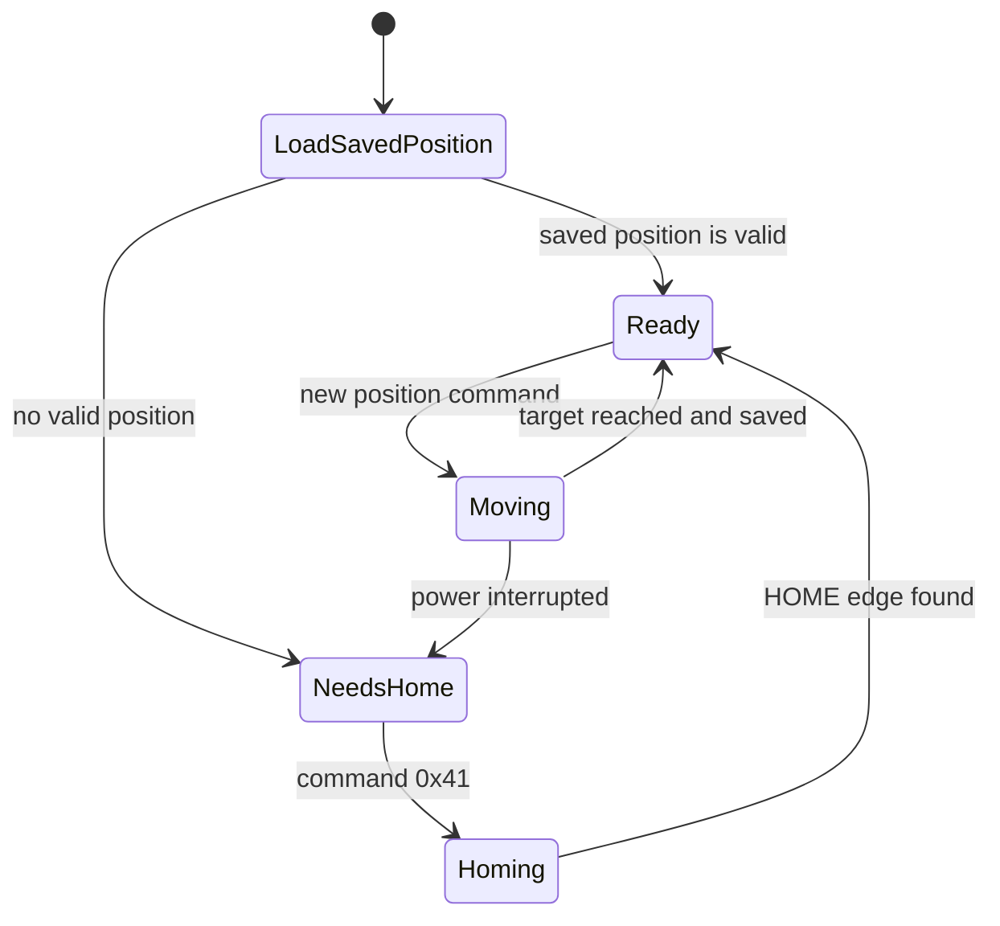

<!-- SPDX-FileCopyrightText: 2014-2026 The Beach Lab <https://beachlab.org> -->
<!-- SPDX-License-Identifier: MIT -->
# Module embedded software

[← Protocol](protocol.md) · [Documentation index](README.md) · [Next: Motherboard firmware →](motherboard-firmware.md)

The same firmware runs on every V2 Final module. A board does not know which
letter it controls or where it appears in a wall. Its place in the cable chain
determines its physical index.

## What it does

- receives and forwards bytes through the SPI ring;
- reports present, ready, and current position;
- finds position 0 with the active-low HOME sensor;
- turns the motor forward without blocking communication;
- saves completed positions in a wear-levelled EEPROM journal;
- marks the position unknown before movement, so interrupted motion cannot be
  reported as successful;
- releases the motor phases and sleeps when idle.

## Source and checks

The implementation is in
[`V2/Firmware/attiny1624-module`](../V2/Firmware/attiny1624-module/README.md).
Portable host tests exercise the protocol and movement state machine. AVR GCC
builds the firmware image for the ATtiny1624.

The repository also preserves
[`V2/Firmware/attiny44-module`](../V2/Firmware/attiny44-module/README.md) for
the incompatible Prototype board.

> [!CAUTION]
> Host tests and a successful firmware build do not prove correct motor,
> sensor, timing, or ring behavior on assembled hardware.

[← Protocol](protocol.md) · [Documentation index](README.md) · [Next: Motherboard firmware →](motherboard-firmware.md)
