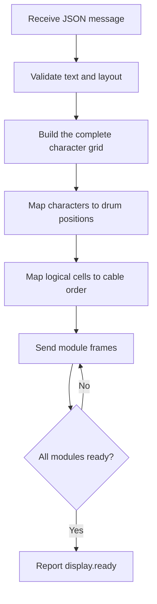

<!-- SPDX-FileCopyrightText: 2014-2026 The Beach Lab <https://beachlab.org> -->
<!-- SPDX-License-Identifier: MIT -->
# Motherboard embedded software

[← Module firmware](module-firmware.md) · [Documentation index](README.md) · [Next: Web interface →](web-interface.md)

The motherboard firmware will be the translator between human-readable text
and the physical module ring.

## Required behavior

The protocol contract already defines the important rules:

- persistent rows, columns, character set, module protocol, and wiring map;
- automatic chain discovery and topology checking;
- deterministic wrapping and alignment;
- explicit errors instead of silent character replacement or truncation;
- conversion from logical cells to physical module order;
- automatic homing and motion-timeout handling;
- one active display update at a time.

## Current status

> [!IMPORTANT]
> Motherboard firmware is not present in the repository yet. The
> [message protocol](../V2/Protocol/MESSAGE_PROTOCOL.md),
> [module protocol](../V2/Protocol/PROTOCOL.md), character-set files, and JSON
> Schema are an implementation contract, not evidence of a running controller.

The firmware should be tested first with simulated modules, then with one real
module, and only then with a longer chain. This separates text/layout bugs from
electrical and mechanical problems.

[← Module firmware](module-firmware.md) · [Documentation index](README.md) · [Next: Web interface →](web-interface.md)
