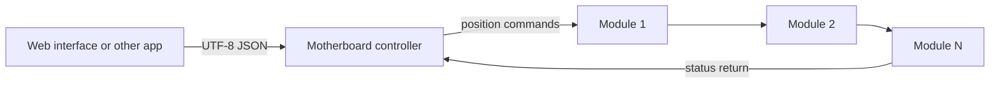

<!-- SPDX-FileCopyrightText: 2014-2026 The Beach Lab <https://beachlab.org> -->
<!-- SPDX-License-Identifier: MIT -->
# Motherboard

[← Module board](module-board.md) · [Documentation index](README.md) · [Next: Chaining and cables →](chaining-and-cables.md)

The motherboard is the central controller for the complete display. It sits
between applications and the chain of character modules.

## Responsibilities

The existing protocol documents define what the controller must do:

- store the display's rows, columns, wiring map, character set, and protocol version;
- discover how many modules are connected;
- turn text into a complete grid of characters;
- convert each character into its physical drum position;
- send commands in the correct chain order;
- wait until every module reports the requested position;
- report clear errors for bad text, wiring faults, or motion timeouts.

## Current status

> [!IMPORTANT]
> A motherboard schematic, PCB, and bill of materials are not present in the
> repository yet. This page describes the controller role defined by the
> [message protocol](../V2/Protocol/MESSAGE_PROTOCOL.md) and
> [module protocol](../V2/Protocol/PROTOCOL.md), not finished hardware.

The eventual hardware needs at least an application connection, the six chain
signals, regulated module power, and enough memory and processing capacity to
lay out a complete display message. Those implementation choices remain open.

[← Module board](module-board.md) · [Documentation index](README.md) · [Next: Chaining and cables →](chaining-and-cables.md)
