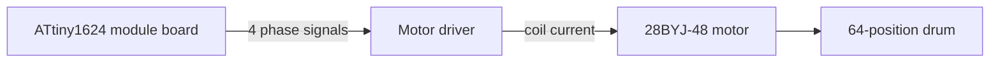

<!-- SPDX-FileCopyrightText: 2014-2026 The Beach Lab <https://beachlab.org> -->
<!-- SPDX-License-Identifier: MIT -->
# Motors

[← Enclosure](enclosure.md) · [Documentation index](README.md) · [Next: Module board →](module-board.md)

Every character module has its own motor. That motor only turns forward: it
advances the drum until the requested one of 64 positions reaches the window.

## Current target

The CAD clearance model and firmware defaults target a 5 V 28BYJ-48 geared
stepper motor with a four-input ULN2003-style driver. The module board sends
four low-power phase signals to the driver; it does **not** drive the motor
coils directly.

## Positioning

The firmware uses forward-only half steps. Its default is 4096 half steps per
drum revolution at 500 half steps per second. Those are starting values, not a
measurement of every motor. The firmware spreads the configured revolution
count across 64 positions so small fractions do not accumulate as a position
error.

The HOME sensor gives the module a known position 0. After a failed or
interrupted movement, the module must find HOME again before normal position
commands are accepted.

## Power budget for ten motors

The ten-module prototype uses one regulated 5 V supply. It does not use a
12 V motor rail or a buck converter. The supply powers the 5 V motor drivers
and module electronics directly; do not source the motor current from a
controller's USB or logic-power pin.

The reference 5 V 28BYJ-48 datasheet specifies 50 Ohm ±7% phase resistance at
25 °C. At 5 V, that is nominally 100 mA per energized phase. The firmware's
half-step sequence can energize two phases, so the design allowance is 200 mA
per moving motor and 2.0 A for ten motors moving simultaneously. At the
datasheet's minimum resistance, the corresponding motor-only peak is about
2.15 A.

Use a regulated 5 V, 3 A supply as the minimum design size. A regulated 5 V,
4 A supply is recommended to leave margin for module logic, HOME sensors,
motor variation, and cable voltage drop. The firmware releases all motor
phases when movement finishes, but the supply and wiring must still be sized
for the simultaneous-motion peak.

The calculation above applies to the referenced 5 V winding. Before connecting
a batch, confirm that every motor is labelled 5 V and measure the resistance
from the red common wire to each phase wire. Recalculate the current if the
measured winding differs materially from 50 Ohm.

Source: Kiatronics/Welten Holdings,
[28BYJ-48 – 5V Stepper Motor datasheet](https://www.osepp.com/downloads/pdf/stepd-01-data-sheet.pdf)
(rated voltage and phase resistance, accessed 2026-08-28).

## What must be checked on hardware

- the actual steps per complete drum revolution;
- motor direction and phase order;
- shaft and mounting-hole fit;
- torque with all 64 cards installed;
- reliable HOME detection;
- heat and power use during repeated movement;
- supply voltage at the most distant driver while all ten motors move.

See the [module firmware guide](module-firmware.md) for the configurable values
and the [mechanical source](../V2/Hardware/Final/mechanical/README.md) for the
motor clearance model.

[← Enclosure](enclosure.md) · [Documentation index](README.md) · [Next: Module board →](module-board.md)
