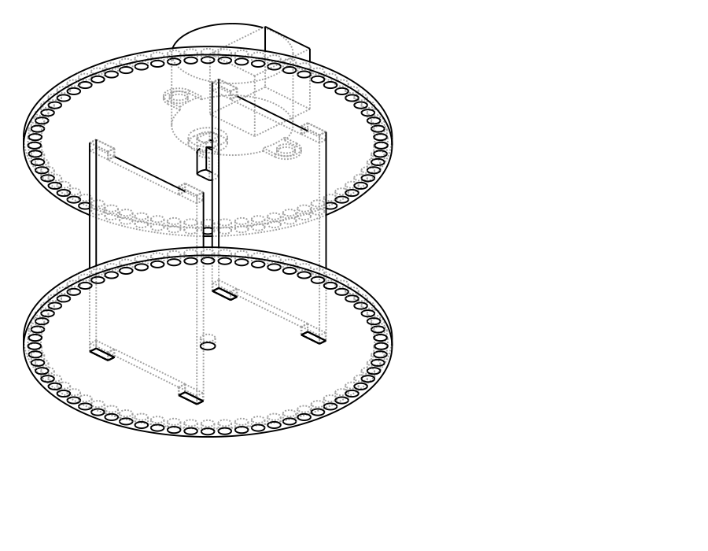
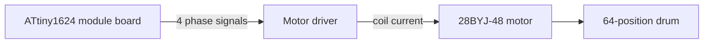

<!-- SPDX-FileCopyrightText: 2014-2026 The Beach Lab <https://beachlab.org> -->
<!-- SPDX-License-Identifier: MIT -->
# Motors

[← Enclosure](enclosure.md) · [Documentation index](README.md) · [Next: Module board →](module-board.md)

Every character module has its own motor. That motor only turns forward: it
advances the drum until the requested one of 64 positions reaches the window.

## Current target

The CAD clearance model and firmware defaults target a 5 V 28BYJ-48 geared
stepper motor with a four-input ULN2003-style driver. The module board sends
four low-power phase signals to the driver; it does **not** drive the motor
coils directly.

## Positioning

The firmware uses forward-only half steps. Its default is 4096 half steps per
drum revolution at 500 half steps per second. Those are starting values, not a
measurement of every motor. The firmware spreads the configured revolution
count across 64 positions so small fractions do not accumulate as a position
error.

The HOME sensor gives the module a known position 0. After a failed or
interrupted movement, the module must find HOME again before normal position
commands are accepted.

## What must be checked on hardware

- the actual steps per complete drum revolution;
- motor direction and phase order;
- shaft and mounting-hole fit;
- torque with all 64 cards installed;
- reliable HOME detection;
- heat and power use during repeated movement.

See the [module firmware guide](module-firmware.md) for the configurable values
and the [mechanical source](../V2/Hardware/Final/mechanical/README.md) for the
motor clearance model.

[← Enclosure](enclosure.md) · [Documentation index](README.md) · [Next: Module board →](module-board.md)
