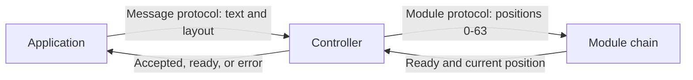

<!-- SPDX-FileCopyrightText: 2014-2026 The Beach Lab <https://beachlab.org> -->
<!-- SPDX-License-Identifier: MIT -->
# Protocol

[← Chaining and cables](chaining-and-cables.md) · [Documentation index](README.md) · [Next: Module firmware →](module-firmware.md)

Alphabets uses two communication layers. The application layer talks in text;
the module layer talks in physical drum positions.

## 1. Message protocol

Applications send newline-delimited UTF-8 JSON. A `display.show` request can
contain text plus wrapping and alignment preferences. The controller knows the
real number of rows and columns and refuses text that cannot fit or cannot be
shown by the installed character set.

The controller first replies that a valid update was accepted. When every
module reaches its target, it reports that the display is ready.

Read the complete [message protocol](../V2/Protocol/MESSAGE_PROTOCOL.md) and
its [JSON Schema](../V2/Protocol/message_protocol.schema.json).

## 2. Module protocol

The controller opens a frame with `LATCH`, shifts one byte per module using a
shared clock, and closes the frame. Commands `0x01` through `0x40` mean drum
positions 0 through 63. `0x41` starts automatic homing on V2 Final modules.

Each status byte says whether a module is present, whether it is ready, and
which position it currently shows. Commands travel in reverse physical order
because every module forwards the byte it receives to the next module.

Read the complete [ATtiny1624 module protocol](../V2/Protocol/PROTOCOL.md).
The older [ATtiny44 protocol](../V2/Protocol/PROTOCOL_V1_ATTINY44.md) is kept
for V2 Prototype hardware.

[← Chaining and cables](chaining-and-cables.md) · [Documentation index](README.md) · [Next: Module firmware →](module-firmware.md)
