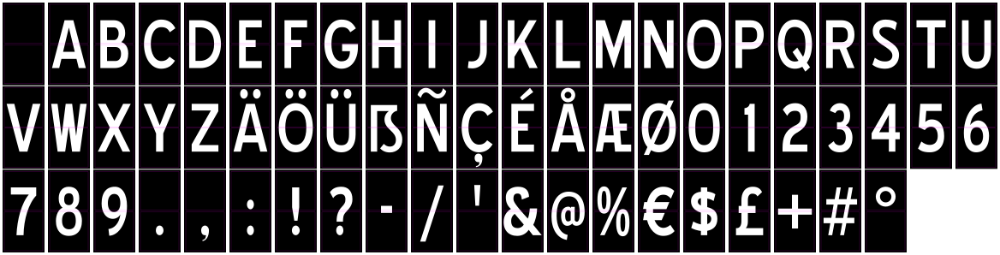
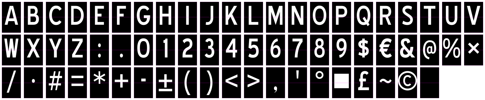

<!-- SPDX-FileCopyrightText: 2014-2026 The Beach Lab <https://beachlab.org> -->
<!-- SPDX-License-Identifier: MIT -->
# Stickers

[← Cards](cards.md) · [Documentation index](README.md) · [Next: Drum →](drum.md)

Stickers give the cards their color and characters. Every character is split
across two neighbouring card faces. The centre cut must therefore remain in
the correct place and the cards must be loaded in the exact generated order.



## Demo 64 for V2 Prototype



Prototype uses this exact 64-position order; the trailing position is one
ASCII space:

```text
ABCDEFGHIJKLMNOPQRSTUVWXYZ:.0123456789$€&@%×/·#=*+-±()<>,'°■£~©␠
```

`␠` denotes the final ASCII space. One uncut Prototype sticker is 50 × 80 mm.
The centre cut creates two
50 × 40 mm faces for the 55 × 43 mm card. Read the
[Prototype sticker guide](../V2/Hardware/Prototype/stickers/README.md) for the
current SVG, cutter SVG, PDF, manifest and font provenance.

## International 64

V2 Final uses the `international-64` sequence. Position 0 is a blank so a
homed display begins empty.

```text
 ABCDEFGHIJKLMNOPQRSTUVWXYZÄÖÜẞÑÇÉÅÆØ0123456789.,:!?-/'&@%€$£+#°
```

The sequence is not just a list for the web interface: it is the physical
order of the cards around every drum. Software sends position numbers, so the
software sequence and installed cards must match exactly.

## Sheet geometry

- One uncut sticker is 45 × 91 mm.
- The centre cut creates two 45 × 45.5 mm faces.
- Each face is centred on a 50 × 48 mm card.
- The standard presets are black/white, black/yellow, yellow/black, and
  white/black.

The generator converts type into vector paths. This keeps the appearance
independent of the fonts installed on the printer's computer.

## Design files

- Read the [sticker generator guide](../V2/Hardware/Final/stickers/README.md).
- See the [character-set definitions](../V2/Hardware/Final/stickers/letters.md).
- Inspect the generated SVG, cutter SVG, JSON manifest, and PDF outputs in
  [`V2/Hardware/Final/stickers`](../V2/Hardware/Final/stickers/).
- Inspect the isolated Demo‑64 Prototype outputs in
  [`V2/Hardware/Prototype/stickers`](../V2/Hardware/Prototype/stickers/README.md).

> [!CAUTION]
> `demo-64` belongs to V2 Prototype. `international-64` belongs to V2 Final.
> Choosing a different preset in software does not change the physical drum.

[← Cards](cards.md) · [Documentation index](README.md) · [Next: Drum →](drum.md)
