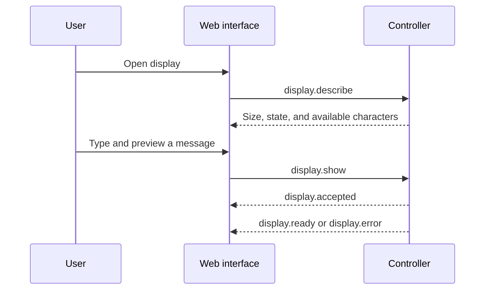

<!-- SPDX-FileCopyrightText: 2014-2026 The Beach Lab <https://beachlab.org> -->
<!-- SPDX-License-Identifier: MIT -->
# Web interface

[← Motherboard firmware](motherboard-firmware.md) · [Documentation index](README.md) · [Project README →](../README.md)

The web interface is the planned human-facing control surface. It should let a
person type a message, preview how it fits, and send it without needing to know
module addresses or drum position numbers.

## What the interface should know

On connection, the interface asks the controller for the current rows,
columns, character set, module count, and layout revision. That response is the
source of truth for its preview. The user may choose wrapping and horizontal or
vertical alignment, but the controller performs final validation.

The interface should show clear errors for unsupported characters, text that
does not fit, a changed layout, a broken return path, or a module that did not
finish moving. It should never silently shorten the message.

## Current status

> [!IMPORTANT]
> A web application is not present in the repository yet. The stable starting
> point is the [message protocol](../V2/Protocol/MESSAGE_PROTOCOL.md) and its
> [JSON Schema](../V2/Protocol/message_protocol.schema.json). The protocol can
> run over a USB serial stream or a TCP stream without changing message meaning.

[← Motherboard firmware](motherboard-firmware.md) · [Documentation index](README.md) · [Project README →](../README.md)
